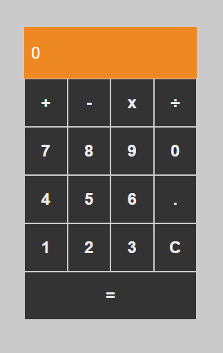

# Desafio 01 - Calculadora (Bootcamp Formação React Developer)
Primeiro projeto do Bootcamp Formação React Developer, onde foram aplicados os conceitos aprendidos durante o primeiro módulo, desenvolvendo todos os componentes e a interface da calculadora utilizando React.

## Adições no projeto

- Adição de um botão "." para operar com números decimais
- Adição de um botão "0" para operar com números que possuem o algarismo 0.
- Com essas adições, a calculadora agora está ainda mais completa e funcional. Espero que os usuários possam aproveitar ao máximo as novas funcionalidades adicionadas.

### Botão "."

- O botão "." foi adicionado para permitir que o usuário possa fazer operações com números decimais, o que é uma funcionalidade importante para uma calculadora. A adição do botão foi feita de forma simples, utilizando o componente Button já presente no projeto.

### Botão "0"

- O botão "0" foi adicionado para permitir que o usuário possa fazer operações com números que possuem o algarismo 0. Assim como o botão ".", a adição do botão "0" foi feita de forma simples, utilizando o mesmo componente Button.

## Referência

 - [Formação React Developer](https://web.dio.me/track/formacao-react-developer)

## Interface da Calculadora

